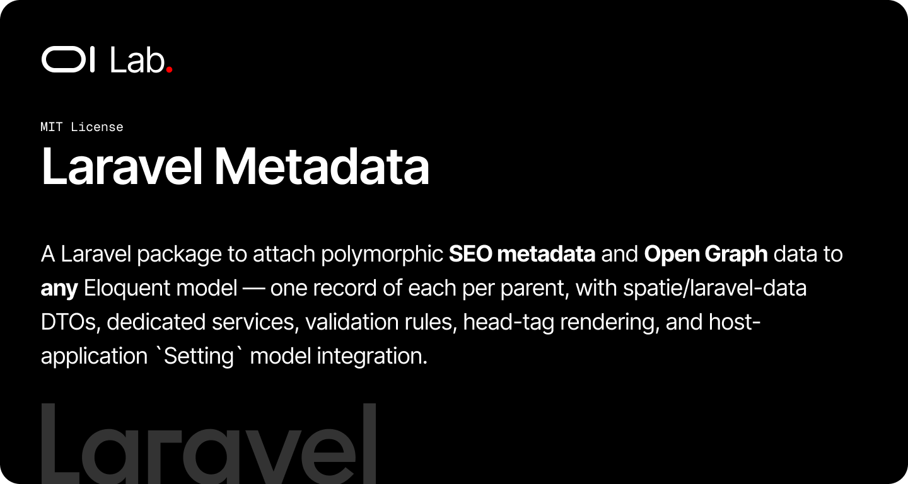

# OI Laravel Metadata

[](https://packagist.org/packages/oi-lab/oi-laravel-metadata)
[](https://packagist.org/packages/oi-lab/oi-laravel-metadata)
[](https://github.com/oi-lab/oi-laravel-metadata/actions)
[](LICENSE)

A Laravel package to attach polymorphic **SEO metadata** and **Open Graph** data to **any** Eloquent model —
one record of each per parent — with spatie/laravel-data DTOs, dedicated services, validation rules, head-tag
rendering, and host-application `Setting` model integration.

## Features

- **Polymorphic Metadata & Open Graph**: a single `metadata` and `openGraph` record per model (`morphOne`)
- **Traits**: opt in with `HasMetadata`, `HasOpenGraph`, or the combined `HasMeta`
- **DTOs**: typed `MetadataData`, `OpenGraphData`, `OpenGraphImageData` (spatie/laravel-data)
- **Services & Facades**: `MetaService` / `OgService` (`Meta` / `Og`) to read, write, and render
- **Head-tag Rendering**: `Meta::render($model)` and `Og::render($model)` emit escaped `<meta>` tags
- **Validation**: `MetadataRequest` / `OpenGraphRequest` form requests, plus `IsoLanguageRule` & `RobotsRule`
- **Setting Integration**: seeds and resolves site-wide values from a host `Setting` model when present

## The Objects

A **Metadata** object:

| Field | Type |
|-------|------|
| `title` | string |
| `description` | string |
| `keywords` | string[] |
| `author` | string |
| `copyright` | string |
| `language` | ISO code (e.g. `fr`, `en`) |
| `revisit_after` | string |
| `robots` | string |
| `googlebot` | string |

An **Open Graph** object:

| Field | Type |
|-------|------|
| `type` | string |
| `title` | string |
| `description` | string |
| `url` | string |
| `image` | object (`url`, `width`, `height`) |

Both are polymorphic, with **at most one per parent** (enforced by a unique index on the morph columns).

## Requirements

- PHP 8.2+
- Laravel 11.0+, 12.0+, or 13.0+
- [`spatie/laravel-data`](https://github.com/spatie/laravel-data) ^4.0

## Installation

```bash
composer require oi-lab/oi-laravel-metadata
```

The package auto-discovers its service provider. Publish and migrate:

```bash
php artisan vendor:publish --tag=oi-laravel-metadata-migrations
php artisan vendor:publish --tag=oi-laravel-metadata-config
php artisan migrate
```

This creates the `metadata` and `open_graphs` tables.

### Local Development

Inside the monorepo, add a path repository to your main project's `composer.json`:

```json
{
    "repositories": [
        { "type": "path", "url": "./packages/oi-lab/oi-laravel-metadata" }
    ]
}
```

## Usage

### Make a Model Meta-aware

```php
use Illuminate\Database\Eloquent\Model;
use OiLab\OiLaravelMetadata\Concerns\HasMeta;

class Page extends Model
{
    use HasMeta; // or HasMetadata / HasOpenGraph individually
}
```

```php
$page->metadata;   // MorphOne — Metadata|null
$page->openGraph;  // MorphOne — OpenGraph|null
```

### Write Values

```php
use OiLab\OiLaravelMetadata\Data\MetadataData;
use OiLab\OiLaravelMetadata\Data\OpenGraphData;
use OiLab\OiLaravelMetadata\Data\OpenGraphImageData;
use OiLab\OiLaravelMetadata\Facades\Meta;
use OiLab\OiLaravelMetadata\Facades\Og;

Meta::update($page, new MetadataData(
    title: 'About us',
    description: 'Who we are',
    keywords: ['team', 'company'],
    author: 'OI Lab',
    language: 'fr',
    robots: 'index, follow',
));

Og::update($page, new OpenGraphData(
    type: 'website',
    title: 'About us',
    url: 'https://example.com/about',
    image: new OpenGraphImageData('https://example.com/og.png', 1200, 630),
));
```

The trait helpers `$page->syncMetadata(...)` and `$page->syncOpenGraph(...)` do the same. Writes use
`updateOrCreate`, so a parent never ends up with a second record.

### Render `<head>` Tags

```blade
<head>
    {!! Meta::render($page) !!}
    {!! Og::render($page) !!}
</head>
```

`Meta::render()` outputs `description`, `keywords`, `author`, `copyright`, `language`, `revisit-after`,
`robots`, and `googlebot` tags, plus `google-site-verification` / `google` verification tags resolved from
settings. `Og::render()` outputs the `og:*` tags plus `og:locale`, `og:site_name`, and `fb:app_id` from
settings. Empty values are omitted; all values are HTML-escaped.

### Validation

```php
use OiLab\OiLaravelMetadata\Http\Requests\MetadataRequest;
use OiLab\OiLaravelMetadata\Http\Requests\OpenGraphRequest;

public function update(MetadataRequest $request, Page $page)
{
    Meta::update($page, MetadataData::from($request->validated()));
}
```

The `IsoLanguageRule` and `RobotsRule` rules are reusable on their own.

## Setting Model Integration

If your application has a key/value `Setting` model, seed the package defaults:

```bash
php artisan metadata:install-settings
```

This inserts the following keys (idempotently — existing keys are never overwritten):

| Key | Default |
|-----|---------|
| `METADATA_FACEBOOK_APP_ID` | `""` |
| `METADATA_GOOGLE_SITE_VERIFICATION` | `""` |
| `METADATA_GOOGLE_BOT` | `""` |
| `METADATA_GOOGLE` | `""` |
| `METADATA_ROBOTS` | `index, follow` |
| `METADATA_OG_LOCALE` | `fr` |
| `METADATA_OG_SITE_NAME` | `""` |
| `METADATA_OG_TYPE` | `website` |

Configure the model class and columns in `config/oi-laravel-metadata.php`:

```php
'settings' => [
    'model' => App\Models\Setting::class,
    'key_column' => 'key',
    'value_column' => 'value',
    'defaults' => [ /* ... */ ],
],
```

When no `Setting` model is present, the resolver and installer no-op gracefully and fall back to config
defaults.

## Overriding Models

Resolve models through `OiMetadata` so your overrides apply everywhere:

```php
// config/oi-laravel-metadata.php
'models' => [
    'metadata' => App\Models\Metadata::class,   // extends OiLab\OiLaravelMetadata\Models\Metadata
    'open_graph' => App\Models\OpenGraph::class, // extends OiLab\OiLaravelMetadata\Models\OpenGraph
],
```

## AI Assistant Skills

```bash
php artisan oi:skills
```

## Testing

```bash
composer test
```

## License

The MIT License (MIT). Please see the [License File](LICENSE) for more information.

## Credits

**[Olivier Lacombe](https://www.olacombe.com)** - Creator and maintainer

Olivier is a Product & Technology Director based in Montpellier, France, with over 20 years of experience innovating in UX/UI and emerging technologies. He specializes in guiding enterprises toward cutting-edge digital solutions, combining user-centered design with continuous optimization and artificial intelligence integration.

**Projects & Resources:**
- [OI Dev Docs](https://dev.olacombe.com) - Documentation for all Open Source OI Lab packages
- [OnAI](https://onai.olacombe.com) - Training courses and masterclasses on generative AI for businesses
- [Promptr](https://promptr.olacombe.com) - Prompt engineering Management Platform

## Support

For support, please open an issue on the [GitHub repository](https://github.com/oi-lab/oi-laravel-metadata/issues).
